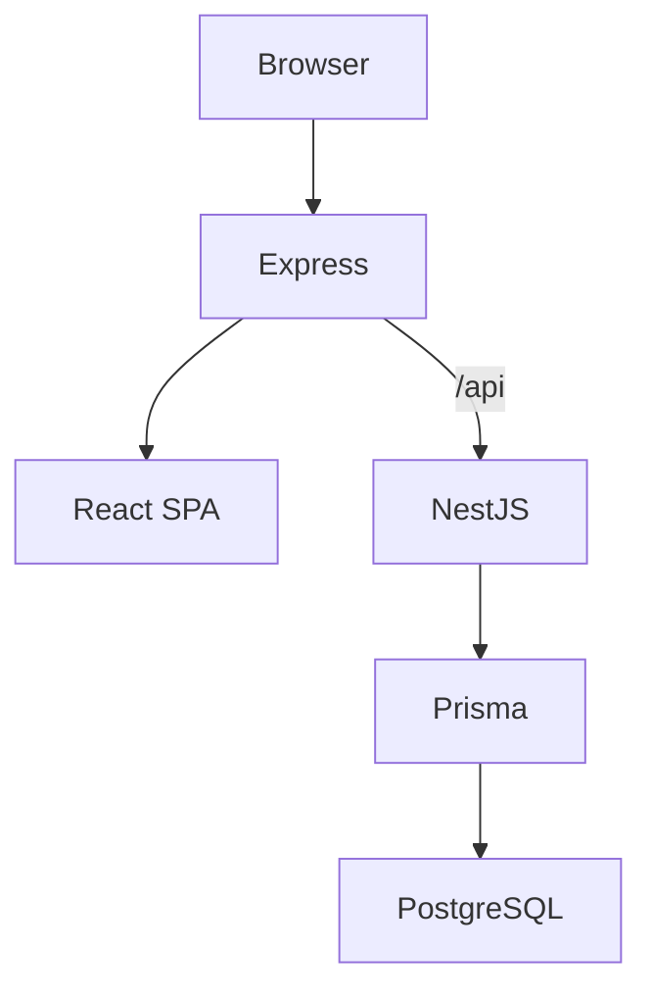

# Arquitetura — Visão geral

## Stack

- **Frontend:** React 19 + Vite + TypeScript + Tailwind + shadcn/ui
- **Estado:** TanStack Query + Zustand
- **Backend:** NestJS + Prisma + PostgreSQL
- **Auth:** JWT access + refresh (httpOnly cookie)
- **Prod:** Express server.js + PM2 + Nginx

## Componentes

## Módulos NestJS

| Módulo | Responsabilidade |
|--------|------------------|
| auth | Login, registro, refresh, JWT |
| company | Tenant, seats, membros |
| project | Projetos por tenant |
| work-item | Backlog hierárquico |
| board | Kanban, colunas, posição |
| sprint | Planning, capacity, métricas |
| release | Roadmap, versões |
| qa | TestCase, Execution, Defect |

## Comunicação

- API REST em `/api/v1/*`
- Prefixo global NestJS: `api/v1`
- Frontend proxy Vite dev → `:8000`
- Produção: Express proxy `/api` → NestJS
