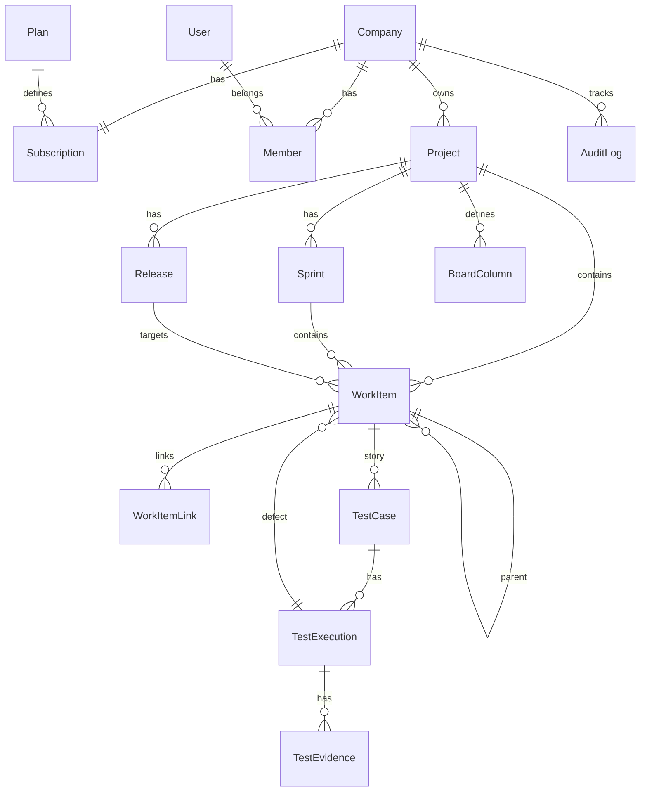

# ERD — Modelo de domínio

## Tabelas principais

- **Company, Plan, Subscription, User, Member**
- **Project, Release, Sprint, BoardColumn**
- **WorkItem** (type + parentId hierárquico)
- **WorkItemLink** (relates, blocks, duplicates)
- **TestPlan, TestCase, TestExecution, TestEvidence**
- **AuditLog, RefreshToken**
